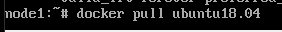
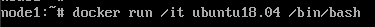
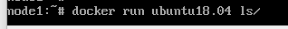

# Aphine-2

###Ej1:

###-Descargamos  una imagen de manera previa

###-Creamos un contenedor de ubuntu:18.04 y tener acceso a un shell en él. Si no hemos descargado la imagen de manera previa se descargará.

###Ej2:

###-Creamos un contenedor de centOs:18.04 y listar el contendido de la carpeta /

###Ej4:

###-Creamos un contenedor de  debian 9 y mostrar el contenido de una carpeta establecida con el parámetro -w

###-Despues Mostramos los contenedores en ejecución (Estado Up)

###-Por ultimo Mostramos todos los contenedores creados ya estén en ejecución (Estado Up) o parados (Estado Exited)

